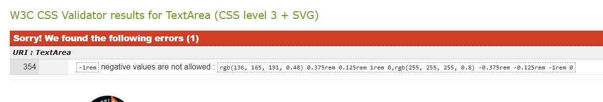
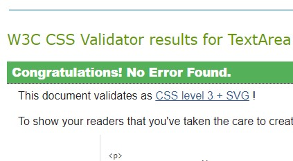
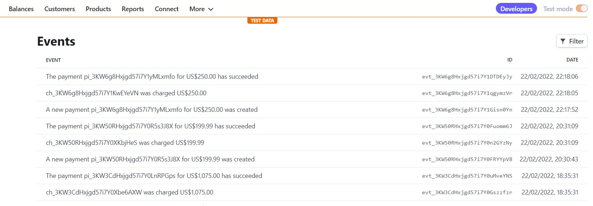
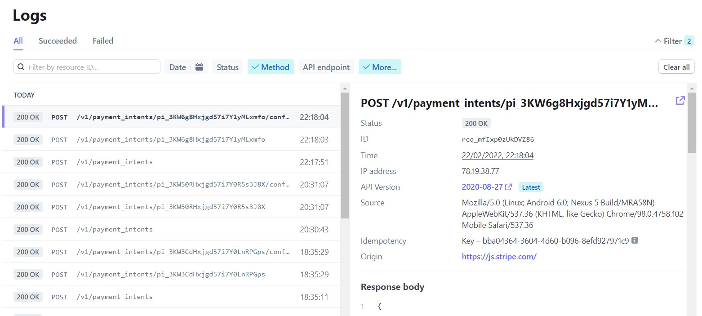
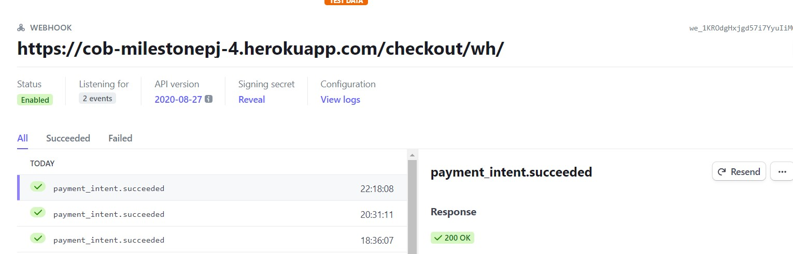
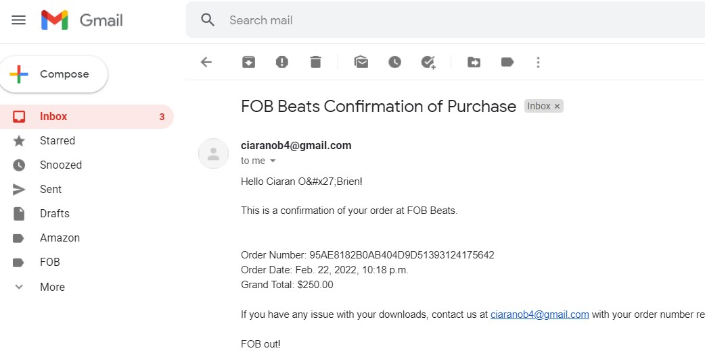

# Milestone Project 4

## Purpose 

The purpose of this site is to complete the fourth Milestone Project for the Code Institute's Full Stack Developer course and can can be found [here](https://cob-milestonepj-4.herokuapp.com/).

## FOB Beats App

Fionn O'Brien (FOB) requested an app store to sell his beats. FOB requires a responsive website that allows users to listen to his beats and buy them for their own musical purposes. Once the user buys a beat(s) they will receive it as a download link in the sale confirmation email. The app allows users to create a profile where they can view their order history. An administation superuser will allow FOB to manage the site on his own with the capacity to add, delete and edit beats to the store.

## User Experience (UX)

### User stories

#### First Time User Goals

*   As a First Time user, I want to view clear and concise content on mobile, tablet and desktop.
*   As a First Time user, I want to learn and understand what the site offers.
*   As a First Time user, I want to easily navigate to the store.
*   As a First Time user, I want to easily search through the beat genres.
*   As a First Time user, I want to search the store with key words.
*   As a First Time user, I want to create an account.
*   As a First Time user, I want to listen to different beats.
*   As a First Time user, I want to add beat to my bag.
*   As a First Time user, I want to easily adjust my bag by removing beats if I require.
*   As a First Time user, I want to buy a beat using a credit card.
*   As a First Time user, I want to be able to download my beats once I have bought them.
*   As a First Time user, I want to seemlessly navigate through all pages of the site.
*   As a First Time user, I want to easily connect with FOBs social platforms.
*   As a First Time user, I want to log out of my account.
*   As a First Time user, I want to buy a beat(s) without having to create an account.

#### Returning User Goals

*   As a Returning user, I want to view my order history.
*   As a Returning user, I want to update my user information.
*   As a Returning user, I want to sort through the beat by genre A-Z or price (high-low).
*   As a Returning user, I want to search for specific type of beat using the search tool.
*   As a Returning user, I want to navigate back to the beat store after adding a beat to my bag.
*   As a Returning user, I want to be able to generate a new password if I forgot my original one.
*   As a Returning user, I want to contact FOB via a contact form.

#### Frequent User Goals

*   As a Frequent user, I want to look through the store for new beats or genres.
*   As a Frequent user, I want to add more reviews and read other reviews about beats.

#### Admin User Goals

The admin user wants the following:

*   As an admin user, I want to manage (add, edit and delete) the beats on site.
*   As an admin user, view entire order history from all users.
*   As an admin user, I want to view and manage user accounts that signed up to the site.
*   As an admin user, I want to view all purchases via Stripe.

### Design

#### Colour Scheme

The main colours used are #292025 (dark purple), white, and #0dcaf0 (light blue). These colors were based around the FOB logo and the image used on the index page.

#### Font

The **Cairo** font is used through the whole app.

#### Imagery

Images and audio files were provided by and owned by my brother Fionn O'Brien (FOB) and he gave permission to use the files for this project.

#### Wireframes

For complete wireframes see this [PDF](static/img/wireframes_msp4).

### Limitations

There were no limitations.

## Features 

The features throughout the site are mininal text, larger text and clear buttons for clear navigation throughout the app. Use of Bootstrap buttons helped this.

### Existing Features

*   Navigation bar

    *   Featured on every page, but depending on the user can differ in the following two scenarios:
        1.  An everyday user - the nav bar contains links to the home, all beats, genres (dropdown to every genre link), profile (dropdown to login or register - this changes to my profile and logout options when the user has logged in), and the beat bag.
        1.  The only difference for an admin user is that a Beat Management option displays in the profile dropdown when they are logged in.
        
    *   The FOB Beat logo provides the user with a link back to the home page. 
    *   The navigation options becomes contained in a responsive Bootstrap burger icon for tablet and mobile devices that provides the nav options in a dropdown form.

*   Footer

    *   Featured identically on every page and contains Font Awesome icons used to provide external links to FOBs social platforms. Each external link has the attribute of target="_blank" which opens the link in a new tab, keeping the user on the site and allowing for seemless UX.

*   Home page

    *   The striking background image creates an inticing effect for the user.
    *   The big header text explains what the site is - a beat store
    *   The user has two immediate options - to use the search tool and search for a beat using key words or click the SHOP NOW button which navigates the user to beat store. 
    *   This is good UX as the user within the 1st 10 seconds of arriving know that this is a store and has two options to go straight to where they can explore.
    *   A short About section at the bottom gives further explanation to twhat the store is and how the user might use a beat for themselves. And a SHOP NOW button is provided at the bottom.

*   All Beats/Genres Page

    *   All beats (and info) are structured in card form. Each card has an image, audio player (to play the beat), the beat name, the price, and a genre button.
    *   There are navigation options within the card: the image and the beat name are links to the beat detail page. The genre button navigated the user to the beats of that specific genre.
    *   Within the audio player the user can play, pause, skip to a specific part of beat, mute the volume, and alter the speed of the beat.
    *   The user can sort the beats in the following ways: Price (high to low, or low to high), Name (A-Z, Z-A), and Genre (A-Z, Z-A). The sorting dropdown options are at the top right of the page and to the left a beat count is provide to tell the user how many beats there are based on the genre selected.
    *   A jump back to the top of the page button is provided in the bottom right of the page for good UX.
    *   Bootstrap responsive displays the beats columns of 4 on 1 row (4 x 1) for large screen, 3 x 1 for medium screens, 2 x 1 on smaller tablets, 1 x 1 on mobile.
    *   When the user selects a specific genre, the only difference is that the genre button appears underneat the main page header.
    *   For admin users - edit and delete options display underneath the genre button.

*   Beat Detail page

    *   Page header is the name of the beat
    *   The page provides the image, audio, price, description and genre button (if clicked navigates the user to that genres beat list).
    *   Two large button ot the bottom of the page to Add the beat to their bag or naviagte back to the beat store.
    *   Responsive - two columns on all device except mobile. Mobile displays a single column.
    *   For admin users - edit and delete options display underneath the genre button.

*   Beat Bag

    *   This page provides the user with all the beats they have added to the bag, the price, and an option to remove the item from the bag.
    *   The page also provides the total cost and options to proceed to checkout or go back for more beats.
    *   For desktop, the beats info appear in a table with the info spread across the row and the check out (and total) appears at the bottom of the page.
    *   For tablet, the total and checkout options appear at the top of the page. The beat imag, price and remove option appear on the left column and the right column on the same row displays the beat name and audio.
    *   For mobile, the tablet view is condensed into one single column.
    *   A jump back to the top of the page button is provided in the bottom right of the page for good UX.

*   Checkout page

    *   This page provides order summary (beat image, name, price, subtotal and total costs), user details name and email for where the order will be sent, the payment by debit or credit card option (processed by strip in the backend), and the option to complete the purchase.
    *   For desktop, the apge has 2 main columns. The left, contains the user details input options, a radio button option to save the user detals (if the user is not registered or not looged in - the option appears as Create an account or sign in to save details), the card payment input option, and the complete purchase option. The right, contains the order summary and total cost.
    *   For tablet and mobile, all features are consensed into 1 column with the order history push to the on top of the user details, etc.

*   Checkout success page

    *   This page provides a thank you message to the user and confirms an email has been sent to the email address provided.
    *   This page provides the beats bought in card form with a download link available so they download the file locally.

*   Register Page

    *   This provides the user the option to create a FOB Beat account.
    *   The user can use the form to input their email, username, and password. The user clicks the sign up button and they are directed to the verify email section.
    *   An email is sent to the given email and the user clicks the link to in the email to verify the email and a FOB Beat account is created.
    *   On the register page, the user has to option to navigate to the sign in (medium sized text below the sign up button) page if they already have an account and have mistakenly navigated to the register page.

*   Login Page

    *   The user can use the form to input their email or username, and password. The user clicks the **sign in** button and they are directed to the verify email section.
    *   Before selecting **sign in** the user can select the radio button to remember the users login deails.
    *   The user clicks the **sign in** button and they are directed back to the home page where they start to explore.
    *   There is medium size text under the page header asking the user if they are new to the site and provides a link to the register page in case the user has mistakenly navigated to the log in page.
    
*   Profile Page

    *   A header with short descriptive text informing the user about the options available on the page.
    *   For desktop and tablet, there are two cards on the same row with an image and a button each so the user can either go the recipes page or add recipes page. On mobile the cards will sit on top of each other in the same column.

*   My Profile Page

    *   This page provides a welcome message and instruction on how to use the profile page.
    *   The users order history is contained within a collapsable bootstrap accordian feature. When the user user slect the accordian their order history displays in table form - order number, date, items, and order total.
    *   Below the oreder history is the users main deails in a form - name and email. The user can update this information as they want and selcting the **update information** button will update and save the new information.

*   Beat Management Pages

    *   The add a new a beat and edit an existing beat pages are straight forward forms. The inputs are genre, beat name, description, price, upload audio file, and upload image file.
    *   The audio and image buttons open the local files to allow the admin user to upload files from their local drive.
    *   The **add beat** button adds the beat to the store and the **edit beat** button updates the existing beat in the store.

*   Bootstrap Toast Messages

    *   These are pop ups that appear in the top-right of the age to the user when they perform a certain action on the app. The popups ccontain messages to the user and an option to close the popup.
    *   The toast appear in the following cases:
        *   A user successfullly signs in
        *   A user successfullly logs out
        *   A user adds a beat to the bag - this messages contains a list of all the items in the bag and button option to take the user the checkout page.
        *   A user successfullly purchases a product - message contains the order number and that a confirmation email has been sent to the given email address.
        *   Admin user is editing a beat
        *   Admin user has successfully added a beat

*   Error 404 and Error 500 pages

    *   These pages were created to inform the user the a certain page doesn't exist or that something went wrong. The page provides a link so the user can navigate back to the homepage seemlessly.

### Features Left to Implement

*   A visual popup describing that only one of each beat can added to the bag. This needs to be supported by backend code to prevent user from adding multiple counts of the one beat.

## Technologies Used

*   HTML - Used for the structure of the website.

*   CSS - Used to style the website.

*   Djang Framework - high-level Python web framework that provided user authentication, content administration, email functionality and all of the backend funcionality for FOB Beats.

*   JavaScript - used to provide interactive features throughout the site e.g. the back to top button and handling strip payments.

*   [Heroku](https://id.heroku.com/login) -  used to deploy app

*   [AWS](https://aws.amazon.com/) - Used the S3 bucket to host static and media files

*   [Bootstrap](https://getbootstrap.com/) - used throughout the site for layout, styling and components. 

*   [Google Fonts](https://fonts.google.com/) - provided the *Cairo* font used throughout the website.

*   [Font Awesome](https://fontawesome.com/) - provided the icons used through the site.

*   [Google Chrome Developer Tools](https://developer.chrome.com/docs/devtools/open/) - used to inpect each page, debug, lighthouse test and test different CSS styles.

*   [GitHub](https://github.com/) - hosting site to store the websites source code and Git pages used to deploy the live site.

*   [Gitpod](https://gitpod.io/workspaces) - the version control to check status, add, commit and push code to GitHubs repository for storage.

*   [Microsoft PowerPoint](https://office.live.com/start/powerpoint.aspx) - used to create the wireframes.

*   [PX converter](https://nekocalc.com/px-to-rem-converter) - to covert px values to rem values.

*   [Stack Overflow](https://stackoverflow.com/questions/9139075/how-to-show-a-confirm-message-before-delete) - used to help create the pop up confirmation alerts when the user deletes data.

## Testing

### Testing Strategy

1.  Complete tests for user goals.

1.  Run all HTML pages through the [W3C HTML Validator](https://validator.w3.org/).

1.  Run all CSS files through the [W3C CSS Validator](http://www.css-validator.org/).

1.  Run all .js files through the [JShint](https://jshint.com/) validator.

1.  Run all .json files through the [JSONLint](https://jsonlint.com/) validator.

1.  Run all python files through [PEP8 online](http://pep8online.com/)

1.  Run tests on Stripe webhook handlers.

1.  Run a lighthouse test for performance.

### Test Results

#### Validation Results

##### HTML Files

1.  main-nav.html

    *   **ERROR:** Error: Element **a** not allowed as child of element **ul** in this context. (Suppressing further errors from this subtree.) Line: 56, 57, 87 

        *   **Fix:** Put each <a> inside an <li>

   
1.  beats, beat-detail & bag.html

    *   **ERROR:** Attribute controlslist not allowed on element audio at this point.

        * **Fix/Note** 
        
        *   The following two links were used as background information for this issue and decision - [Link 1](https://developer.mozilla.org/en-US/docs/Web/HTML/Element/video#attr-controlslist) and [Link](https://webmasters.stackexchange.com/questions/132621/w3c-validator-attribute-controlslist-not-allowed-on-element-audio-at-this-p).

        *   Link 1 lists controlist as an attribute that can be used and link 2 acknowledges the that although its not in the current official HTML5 standard, it is a functioning experimental attribute.

        *   For the purposes of this project, no controllist attribute would allow the user to download the beats without paying money. A criteria for this project is to have no html validation errors, so there were two options. Leaving the controlist in was chosen as it is (1) functioning correctly and (2) it would defeat the purpose of an e-commerce site to allow the user to take the beat for free. But the error is acknowledged.

1.  add_beat.html

    *   **ERROR:** Duplicate attribute id. At line 366, column 115

        *   **Fix:** Custom widget.py (CustomClearableFileInput) was creating an image id hence duplicating the ids. The widget functionality was deleted an entirely and the form was returned to its base function and styling. THe error was fixed.

1.  bag.html 

    *   **ERROR:** Table columns in range 4…5 established by element td have no cells beginning in them.

        *   **Fix:** Removed colspan from attributes

1.  bag.html 

    *   **ERROR:** Duplicate ID remove_3.

        *   **Fix/Note:** This page is structured so that large table displays for desktop and the structure changes to a grid design for tablet and mobile. It is for this reason there is duplicate IDs. The content within the structure is duplicated in order to pass the same info the user on all device types. An effort was made to hide remove buttons using bootsrap (d-none) to avoid the code being rendered to the DOM when on large screen. This effort was ineffective.
 

##### Python (app.py) 

1.  webhook_handler.py

    *   **ERROR:** lines 63 & 64 - missing whitespace around operator e.g., `profile.default_full_name=billing_details.name,`

    *   **Fix:** Added a space before and after the = sign on these lines

    *   **ERROR:** lines 87 & 118 - lines are too long

    *   **Fix:** Added a \ to break the lines into 2 smaller lines

1.  settings.py

    *   **ERROR:** lines 142, 145, 148, 151 are too long

    *   **Fix:** `'NAME': 'django.contrib.auth.password_validation.'
                    'UserAttributeSimilarityValidator',`

Python errors fixed and is producing 0 errors.

##### CSS

The CSS validations produced 1 error in base.css:

*   **ERROR**

    

    *   **Fix** - Removed the negative value and no errors were found.

*   Checkout css result

    

*   0 errors for profile.css

##### JaveScript Files

JavaScript validations produced 0 errors.

##### JSON Files

JSON validations produced 0 errors.

#### User Goal Results

##### First Time users

*   As a First Time user, I want to view clear and concise content on mobile, tablet and desktop - Testing was performed to ensure there was no clusters of over information, well spaced and aesthically pleasing on tablet and mobile.

*   As a First Time user, I want to learn and understand what the app offers - Testing was performed to verify enough information is provided to tell the user about what the app offers.

*   As a First Time user, I want to easily navigate to the store - Testing was performed on the SHOP NOW buttons, the search bar, and the beat and links to ensure they navigate the user to the store. 

*   As a First Time user, I want to easily search through the beat genres - Testing was was performed on the genre dropdown functionality and the genre links within the dropdown menu to ensure the user can easily navigate to each genre.

*   As a First Time user, I want to search the store with key words - Testing was performed on the search bar by inputing key words and searching. The user is provided with beat options associated with the key word.

*   As a First Time user, I want to create an account - Testing was performed to test account creation. The user can easily create an account and receives a verify account email in order to verify their account securely.

*   As a First Time user, I want to listen to different beats - Testing was performed on the audio files to ensure the user can listen to a beat befor they purchase it.

*   As a First Time user, I want to add beat to my bag - Testing was performed on the the Add to bag button to ensure the user can successfully add a beat to their bag and view the contents of their. 

*   As a First Time user, I want to easily adjust my bag by removing beats if I require - Testing was performed and the user can easily remove a beat from their bag in the Beat Bag page.

*   As a First Time user, I want to buy a beat using a credit card - Testing was performed and the user can purchase a product using their debit/credit card information.

*   As a First Time user, I want to be able to dwonload my beats once I have bought them - Testing was performed and the user is presented with a download link(s) for the beat(s) they purchased in the order confirmation page.

*   As a First Time user, I want to seemlessly navigate through all pages of the site - Testing was performed on all navigation links to ensure the user can seemlessly navigate throughout the site.

*   As a First Time user, I want to easily connect with FOBs social platforms - Testing was performed on the social icon links in the footer to ensure that the user is navigated to the chosen social media platform and that the link opens in a new tab to keep the user in the app allowing for seemless UX.

*   As a First Time user, I want to log out of my account - Testing was performed and the user can easily log out of their account. When selecting the logout option the user is brought to another page to verify that the user wants to log out.

*   As a First Time user, I want to buy a beat(s) without having to create an account - Testing was performed and the user without a FOB account can purchase a beat and recieve the order confirmation email.

##### Returning Users

*   As a Returning user, I want to view my order history - Testing was performed and the app stores orders made made by the user. Tsting on the accordian dropdown was also performed to ensure the user can see the history on the My Profile page.

*   As a Returning user, I want to update my user information - Testing was performed and the user can succesfully update their user information and new information is saved on My Profile page.

*   As a Returning user, I want to sort through the beat by genre A-Z or price (high-low) - Testing was performed and the user can sort through the beats as they wish. The sorting functionality works whether the user wants sorted alphabetically or by price.

*   As a Returning user, I want to search for specific type of beat using the search tool - Testing was performed and the user can input descriptive words into the search bar and the app will provide options. If the user inputs a word incorrectly spelt or a word that is not referenced in the store, they will find no results.

*   As a Returning user, I want to navigate back to the beat store after adding a beat to my bag - 

*   As a Returning user, I want to be able to generate a new password if I forgot my original one - Testing was performed and the user can create a new password if they can't login as they have forgotten there password. A change password link is sent to the email provided. Once they follow the steps they can successfully login using the new password.

*   *   As a Returning user, I want to contact FOB via a contact form - Successful testing ensured that when a user submits a contact form the information is sent to the admin database.

##### Frequent Users

*   As a Frequent user, I want to look through the store for new beats or genres - the testing above indicated that user can easily navigate through the site which allow frequent users to easily check for new beats and genres

##### Admin User Goals

*   As an admin user, I want to manage (add, edit and delete) the beats on site - Testing was perfomred on the beat management pages to ensure the admin user can easily edit, add and delete beats.

*   As an admin user, view entire order history from all users - using the admin/ django function the admin user can view all orders from all users.

*   As an admin user, I want to view and manage user accounts that signed up to the site - using the admin/ django function the admin user create, delete, edit accouts. View existing users and their order history individually.

*   As an admin user, I want to view all purchases via Stripe - using the the admin users stripe.com/developers account the admin user can view all payments that have gone through the site.

#### Stripe Test

*   Testing was performed to ensure payment events from the app were being logged as events in [Stripe](https://dashboard.stripe.com/test/developers). The image below shows payment events are being recorded in Stripe:

    

*   Testing was performed to ensure payment intents were being logged and print a 200 success post in [Stripe](https://dashboard.stripe.com/test/developers).
    The image below shows payment intents are logged in Stripe with 200 status:

    

*   Testing was performed to ensure the weebhook endpoints were providing a 200 OK response for payment_intent.succeeded. The image below shows the testing was successful:

    

*   Testing was performed to ensure the app sent order confirmation of purchase emails to user. Testing was successful (image below) ensuring that user email info in settings.py, stripe keys, and the webhook handlers are running correctly.

    

#### Lighthouse Test Results

See the following lighthouse test results:

 \
**Mobile test result**

 \
**Desktop test result**

These test results indicate that the site peforms very well overall. It also shows that the Performance could be improved a lot for mobile.

Due to the time constaints of this project it is not feasible to act further on this. In a normal working situation time would be taken to optimise performance.

## Deployment

### Project Creation

Created the project by:

1.  Navigating to my [user profile](https://github.com/cobobc).
2.  Selecting the **Respositories** tab.
3.  Selected the **New** button.
4.  Under Repository tempate, select the Code Institute template from the dropdown menu.
5.  Entered milestone_project_4 for the **Repository name**.
6.  Select **Create Repository**. 

### During the Project

The following commands were used throughout the project:

*   `git add .` - This command was used to add files to the staging area before commiting.
*   `git commit` - This command was used to to commit changes to the local repository.
*   `git push` - This command is used to push all commited changes to the GitHub repository.
*   `python3 manage.py startapp (app name)` - to create new apps in the site
*   `python3 manage.py runserver` - run the site locally
*   `python3 manage.py migrate` - migrate newly installed applications
*   `python3 manage.py loaddata` - load beat and genre data

### Deployment to Heroku

1.  Create application:

    1. Navigate to Heroku.com and login.
    1. Select the **new** button.
    1. Select **create new app**.
    1. Enter the app name.
    1. Select the region.
    1. In the resourced tab > Provision new Postgres, select **Provison** in the Postgres plan popup.

1. Connect Heroku to the terminal:

    1. In the gitpod terminal, install `dj-database-url`.
    1. In the gitpod terminal, install `psycopy2-binary`.
    1. In the gitpod terminal, run `freeze > requirements.txt`.

    1. In setting.py, import dj-database-url from the heroku app > settings > reveal configs.
    1. Save settings.py
    1. Run `python3 manage.py migrate`
    1. Run `python3 manage.py loaddata genres`
    1. Run `python3 manage.py loaddata beats`
    1. Sign in as superuser in the terminal.
    1. In the gitpod terminal, install `gunicorn`.
    1. Create Procfile to serve the app (fob-beats).

    1. In the gitpod terminal, run `heroku login -i`
    1. Run `heroku config:set DISABLE_COLLECTSTATIC app cob-milestonepj-4`

    1. Update ALLOWED HOST FIELD in settngs.py.
    1. Save settings.py

    1. In the terminal, run `git add .`
    1. Run `git commit`
    1. Run `git push`
    1. Run `git push heroku main` to deploy to heroku
    1. Run `heroku git:remote -a cob-milestonepj-4`
    1. Run `git push heroku main`

1.  Set up connection to Github Repository:

    1. Select the **Deploy tab > GitHub > Connect to GitHub**.
    1. Enter the repository name for the project and select **search**.
    1. When the repo has been found, select the **connect** button.

1.  Enable automatic deployment:

    1. Select the **Deploy** tab.
    1. In the Automatic deploys section, choose the branch you want to deploy.
    1. Select **Enable Automation Deploys**.

1. Connect Django to the S3 Bucket:

    1.  In the terminal, install `boto3` and `django-storages`
    1. Enter the AWS_ACCESS_KEY and SECRET_KEY into heroku configs and settings.py
    1.  Add USE_AWS value to True in Heroku
    1. Delete the DISABLE_COLLECTSTATIC value in heroku
    1. Create a custom_storages.py file for product images.

### Run Locally

**Note:** The project will not run locally with database connections unless the user sets up an env.py file configuring IP, PORT, MONGO_URI, MONGO_DBNAME and SECRET_KEY.

1.  Navigate to the GitHub [Repository](https://github.com/cobobc/cob_MilestonePJ_4.git).
1.  Select the Code drop down menu.
1.  Either Download the ZIP file, unpackage locally and open with IDE (This route ends here) OR Copy Git URL from the HTTPS dialogue box.
1.  Open your developement editor of choice and open a terminal window in a directory of your choice.
1.  Use the 'git clone' command in terminal followed by the copied git URL.
1.  A clone of the project will be created locally on your machine.

## Credits

### Code

*   [W3Schools](https://www.w3schools.com/) helped throughout the project with general element and attribute uncertainties.

*   [Bootstrap](https://getbootstrap.com/docs/5.1/getting-started/introduction/) - used this as the source code for the theme of the app. Includes JS for interactive nav bar use.

*   [Stack Overflow](https://stackoverflow.com/questions/9139075/how-to-show-a-confirm-message-before-delete) - used to help create the pop up confirmation alerts when the user deletes data.

*   [gitconnected](https://levelup.gitconnected.com/django-customize-404-error-page-72c6b6277317) - used to help with creating error 404 page for html and python.

*   [Beautiful CSS box-shadow examples](https://getcssscan.com/css-box-shadow-examples) - used to help style cards with box shadows

*   [HCodePen Home Search Bar | CSS Tutorial Mike Dane](https://codepen.io/mikedane94/pen/wvowGgJ) - used as a guide to help style the search bar on the homepage.

*   Chris Z. (@ckz8780) a Tutor at Code Institute code - all his django videos and tutorials make up the a lot of the structure and logic of this app. His [boutique_ado_v1](https://github.com/Code-Institute-Solutions/boutique_ado_v1.git) provided a lot of the structure and inspiration for this project.

### Content 

The contents of this app was all created by FOB and Ciaran O'Brien.

### Media 

Images and audio files were provided by my brother Fionn O'Brien (FOB) and he gave permission to use the files for this project.

### Acknowledgements

I'd like to thank my mentor Spencer Barriball for his guidance, efficiency and positivity throughout my project.

I'd like to thank mentor Daisy McGirr who kindly stepped in to take my final project review as Spencer was on holidays. I am so thankful for her help.

Thank you to Chris Z. (@ckz8780) a Tutor at Code Institute whose teaching techniques helped me understand how to build a full stack site using Django. A lot of this project's code structing and testing was sourced from his amazing Intro to Django and Boutique Ado videos/tutorials.

Thanks to various Slack users for helping with issues I had throughout the journey.

Thanks to Code Institute tutors for stepping in when I was really stuck on a bug.

Thank you to my tester friends Fionn and Ollie who allowed me to contsantly test my email and purchase functionality with their email addresses.